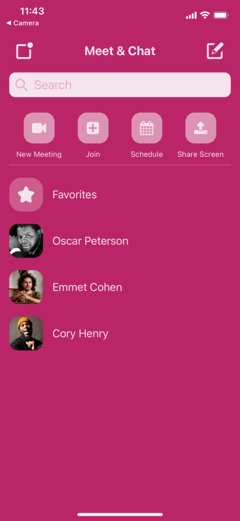

# Video Jam

Video Jam is a mobile app the enables users to connect to their own unique rooms and turn on their cameras. This is accomplised by entering a room code generated by the user who creates the room.

## Running the App

#### Prerequisites
*Node.js
*Expo Cli (for computer)
*Expo Go (for mobile phone)
*Ngrok 

#### Set-up
1. Open a command prompt, change directory to frontend, run `npm install` (do the same for the backend)
2. To start the frontend, type `expo start` into the respective command prompt.
3. To start the backend, type `nodemon index.js` into the respective command prompt.
4. Open ngrok, type `ngrok http 3001` and hit enter, open an IDE and navigate to `frontend/components/MeetingRoom.js` line 45, change URL accordingly
5. Open camera app on mobile device and scan QR code found in frontend command prompt
6. Repeat step 5 using other mobile devices to start video jamming!

## Demo
https://www.youtube.com/embed/9aDjXUh6AlY

## Future Features
#### Peer-to-Peer Audio-Visual Streaming
In order to facilitate real-time audio and visual communication between devices in a room, WebRTC would be used. In fact, there already exists an npm package called "react-native-webrtc" . The catch is that this module is not supported in Expo Go, and would therefore require a development build to run the app. This would require us to install and build our app using and android or ios simulator. As of the last push, I was not able to get either of these simulators running properly on my computer.
Hopefully, in a few short years, these native dependecies can become accessible through Expo Go itself.

## Teck Stack
* Frontend
  * React Native
    * react-navigation
    * react-native-vector-icons
* Backend
  * Node.js
* Misc.
  * Socket.io
  * ngrok
